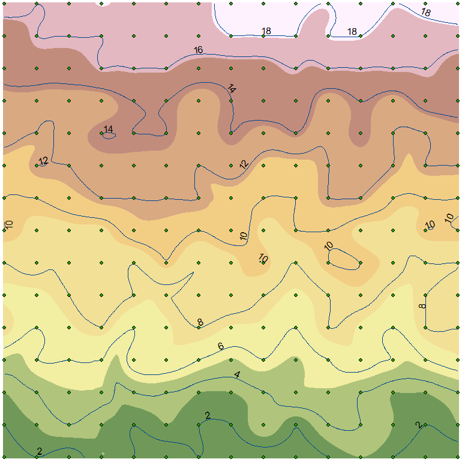

### Dr. James Heiss   ENVI3010   GIS in Earth and Environmental Sciences   james_heiss@uml.edu   Date
### Lab 1

#### Purpose
Lab 1 images, tables, text, etc. go in these subheadings.

 
**Figure 1.** Example sand table landscape.
  
More text.

#### Objective
Text.
#### Methods
Text.
#### Data, answers, graphics
Text.
#### Summary and Conclusion
Text.

